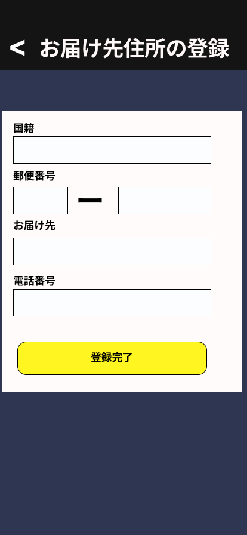

### 画面詳細図
## お届け先住所登録
### お届け先住所登録は以下のリンク先
[お届け先住所登録](https://www.figma.com/file/aUIBKwBN1BN1f6srbwgCz3/%E4%B8%AD%E6%9D%91%E5%8B%87%E8%BC%9D-s-team-library?node-id=326%3A133)
*****

******

|ID|要素|内容|アクション|イベント|対応OB|
|---|---|---|-----------|-------|------|
|1  |バナー|画面タイトル表示|-|-|-|
|2  |国籍|テキスト|-|-|-|
|3  |国籍|入力欄|国籍入力|-|〇|
|4  |郵便番号|テキスト|-|-|-|
|5  |郵便番号|入力欄|郵便番号入力|-|〇|
|6  |お届け先|テキスト|-|-|-|
|7  |お届け先|入力欄|お届け先入力|-|〇|
|8  |電話番号|テキスト|-|-|-|
|9  |電話番号|入力欄|電話番号入力|-|〇|
|10 |登録完了|ボタン|クリック|お届け先処理|-|
|11  |戻る|ボタン|クリック|商品購入画面に遷移|-|
