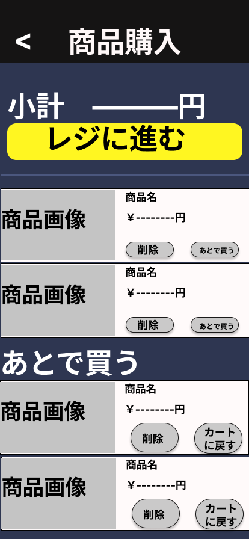

### 画面詳細図
## 商品購入
### 商品購入画面は以下のリンク先
[商品購入画面](https://www.figma.com/file/aUIBKwBN1BN1f6srbwgCz3/%E4%B8%AD%E6%9D%91%E5%8B%87%E8%BC%9D-s-team-library?node-id=326%3A49)
*****

******

|ID|要素|内容|アクション|イベント|対応OB|
|---|---|---|-----------|-------|------|
|1  |商品購入|テキスト|-|-|-|
|2  |小計|合計表示|-|-|〇|
|3  |レジに進む|ボタン|クリック|お届け先住所の登録画面に遷移|〇|
|4  |商品| テキスト画像|-|-|〇|
|5  |あとで買う|ボタン|レジから後で買うに移動|-|-|
|6  |削除|ボタン|レジから削除|-|-|
|7 |後から買う|テキスト|-|-|-|
|8  |カートに戻す|ボタン|カートに入れる|-|〇|
