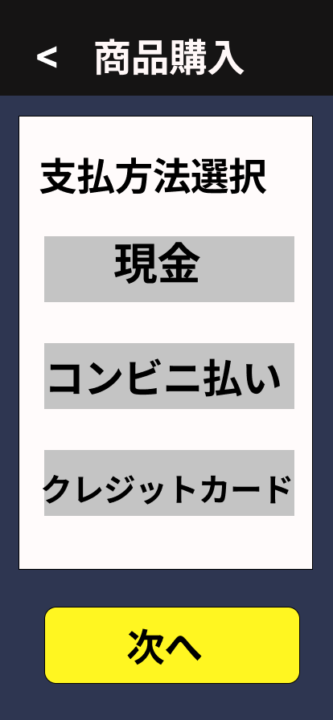

### 画面詳細図
## 支払方法
### 支払方法選択画面は以下のリンク先
[支払方法選択画面](https://www.figma.com/file/aUIBKwBN1BN1f6srbwgCz3/%E4%B8%AD%E6%9D%91%E5%8B%87%E8%BC%9D-s-team-library?node-id=326%3A161)
*****

******

|ID|要素|内容|アクション|イベント|対応OB|
|---|---|---|-----------|-------|------|
|1  |バナー|画面名表示|-|-|-|
|2  |戻る|ボタン|クリック|配達方法選択画面に遷移|-|
|3  |支払方法選択|テキスト|-|-|-|
|4  |現金|ボタン|クック|値保持|〇|
|5  |コンビニ払い|ボタン|クリック|値保持|〇|
|6  |クレジットカード|ボタン|クリック|値保持|〇|
|7  |次へ|ボタン|クック|購入商品確定画面に遷移|-|
