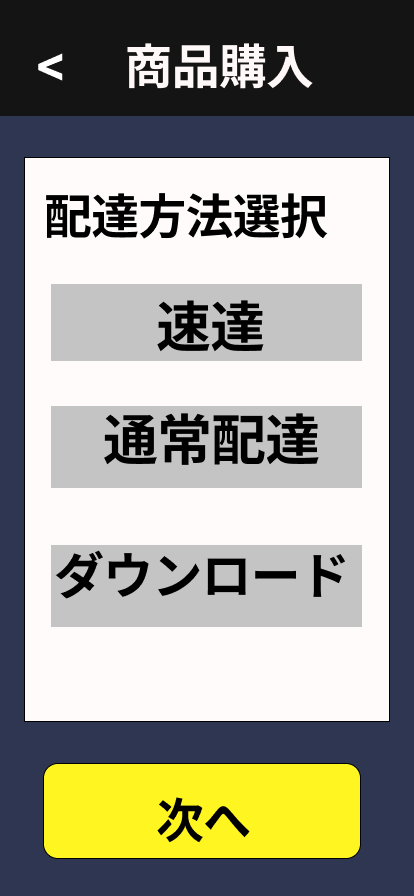

### 画面詳細図
## 配達方法
### 配達方法選択画面は以下のリンク先
[配達方法選択画面](https://www.figma.com/file/aUIBKwBN1BN1f6srbwgCz3/%E4%B8%AD%E6%9D%91%E5%8B%87%E8%BC%9D-s-team-library?node-id=326%3A150)
*****

******

|ID|要素|内容|アクション|イベント|対応OB|
|---|---|---|-----------|-------|------|
|1  |バナー|画面名表示|-|-|-|
|2  |戻る|ボタン|クリック|お届け先住所登録画面に遷移|-|
|3  |速達|ボタン|クック|値保持|〇|
|4  |通常配達|ボタン|クリック|値保持|〇|
|5  |ダウンロード|ボタン|クリック|値保持|〇|
|6  |次へ|ボタン|クック|支払方法画面に遷移|-|
|7  |配達方法選択|テキスト|-|-|-|
